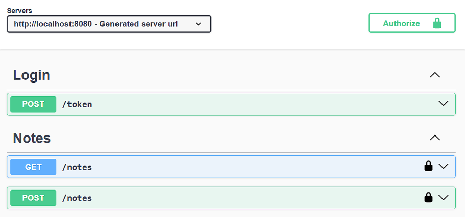
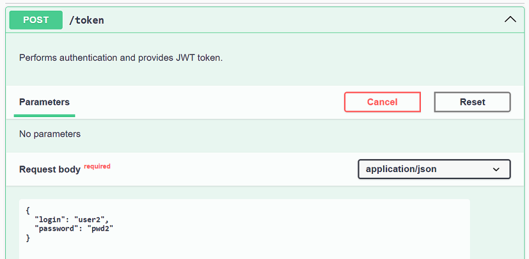
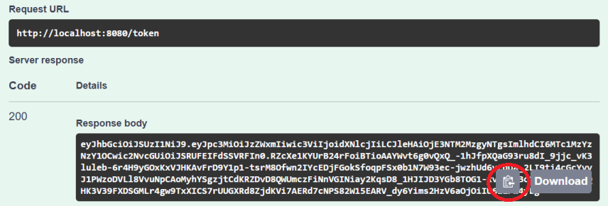
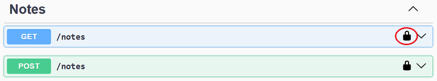
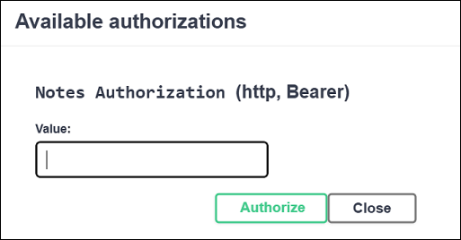

## JWT-demo Spring Boot application

### Prerequisites
*Java*: requires Java 17+ version and Maven dependency management tool.  
*Python*: version 3.x, `requests` library should be installed in your environment.

### JWT implementation
Latest Spring Security releases provide support for OAuth2 JWT, so here we are using spring-based implementation as it is naturally integrated into
Spring Security architecture and lets us avoid the need to handle low-level details.

### Building / Testing / Launching
Use following command to build demo application (it will also execute tests):    
`mvn clean package` from `/java-service` directory.  
Use `mvn test` to run tests only.  
To launch application use `java -jar target/demo-jwt-0.0.1-SNAPSHOT.jar` from `/java-service` directory after it was built.

### Accessing REST endpoints
The most convenient way is to use Swagger (OpenApi), it provides easy and intuitive usage. 
After application starts, go to `localhost:8080/swagger-ui/index.html` page, it looks like  
  

OpenApi docs available at `http://localhost:8080/v3/api-docs`, may be used with Postman or other tools.

### Predefined users
There are two predefined users with credentials `user1/pwd1` and `user2/pwd2`.  
The first user has `READ` authority and can access only `GET /notes` endpoint.  
Second user has `READ, WRITE` authorities and can access both `GET /notes` and `POST /notes` endpoints.

### Authorization flow using Swagger UI

First use `/token` endpoint with proper credentials to request bearer token:  
  
  
  
Copy token from response:  
  
  
  
Click lock icon in Notes endpoint:  
  
  
  
Pop-up form appears where you can enter token for authorization:  
  
  

### Python test
Just launch `fetch_notes.py` from `/python-client` directory.

### Accessing in-memory H2 database
Database console is available at `http://localhost:8080/h2-console/`.
JDBC url is `jdbc:h2:mem:db`  
Application uses Liquibase to create schema and populate some data (see `main/resources/db` folder). 

### Notes
Simplifications used in this demo:   
- private key is just placed in resources as is
- hard-coded credentials for predefined in-memory users
- no logging
- no custom error responses

